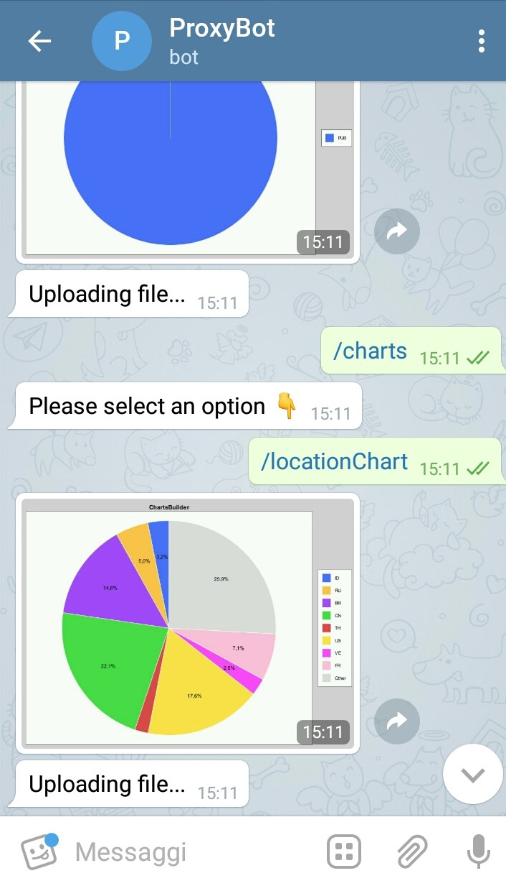
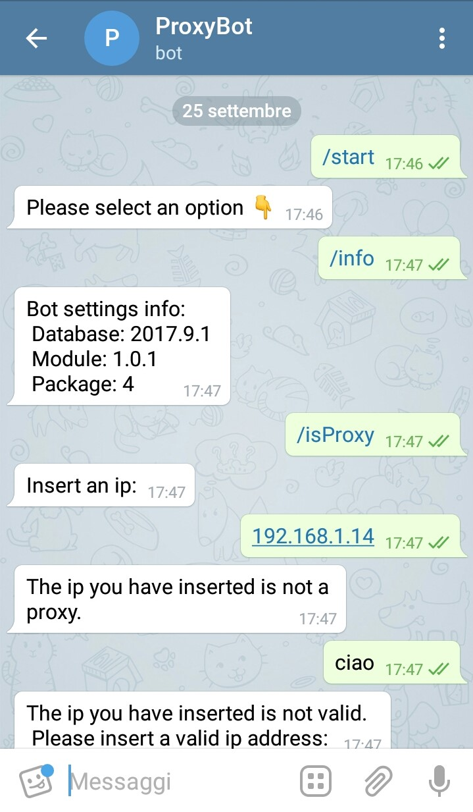
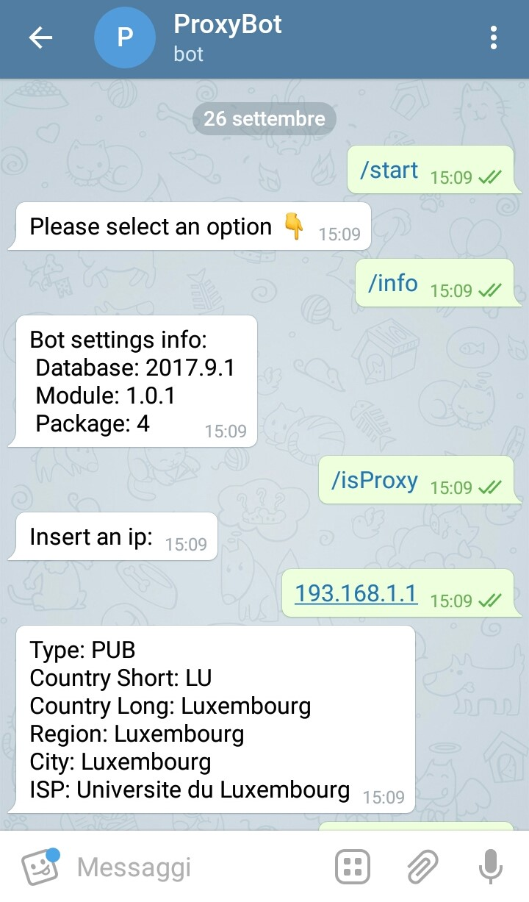
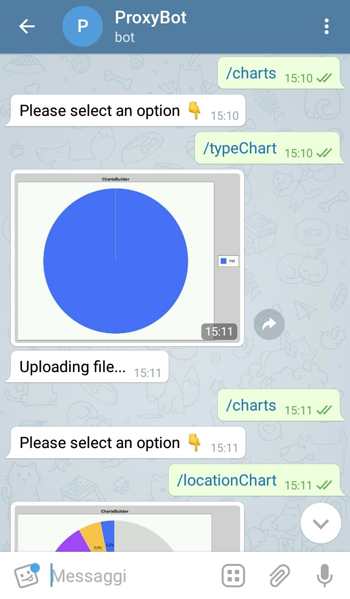
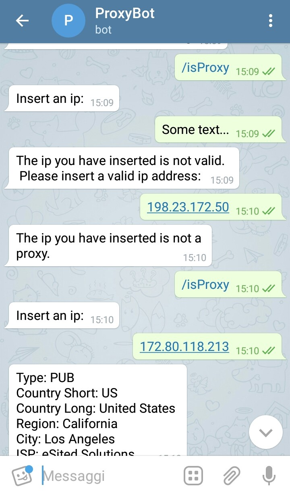

# Ip2Proxy-Telegram-Bot

Ip2ProxyBot is a modern telegram bot that uses both BIN and CSV ip2Proxy databases to retrieve informations and statistics about proxies. 

Installation 
------------
- Download this project zip 
- Extract it  
- Go to [Telegram Bot Father](https://web.telegram.org/#/im?p=@BotFather) 
- Copy these [Commands] (BotFatherCommands.txt)
- Open the project with and ide 
- Include external jars from the directory: [External Jars](external%20jars)
- Fill the field "botToken" and "botUsername" in [Bot Settings File](src/BotSettings.java) with data got from [Telegram Bot Father](https://web.telegram.org/#/im?p=@BotFather) 

Usage And Commands
------------------
Every session starts with the */start* command. At this point you can select from the keyboard an option among: 
- */IsProxy*
- */Charts*
- */Info*

***/IsProxy*** command is used to check if an ip is a proxy, in this case the bot will show details about the proxy, otherwise it will tell the user that the inserted ip is not a proxy. In the case the inserted ip is not valid, the bot requests for another ip.  

***/Charts*** command returns a keyboard throught which you can choose between: 
- */typeChart* 
- */locationChart* 
The first command will send you an image of a chart with the percentage of every type of proxy, the other one will return a chart with different proxies location (in this case only countries with a minimun of 2% of total proxies create a section, otherwise they are added on "Other" section) 
 
 ***/Info*** command returns some infos about database version
 
3rd party libraries 
-------------------
- [Official ip2Proxy BIN Library](https://github.com/ip2location/ip2proxy-java) 
- [TelegramBots](https://github.com/rubenlagus/TelegramBots) library used to create Telegram Bots in java 
- [XChart](https://github.com/timmolter/XChart) library used to create charts in Java
- [emoji-java](https://github.com/vdurmont/emoji-java/releases) 

Official BIN Library Modifications
----------------------------------
The [Official BIN Library](https://github.com/ip2location/ip2proxy-java) has been modified to a better implemention of OOP encapsulation concept. 

Databases 
---------
This library requires IP2Proxy BIN database to check if an IP address is a proxy and  CSV database to create statistics charts. 
The databases can be downloaded at: 
-Free IP2Proxy BIN Data: http://lite.ip2location.com
-Commercial IP2Proxy BIN Data: http://www.ip2location.com/proxy-database

Screenshots 
----------- 

 
 
 
 
 

Avaibility 
----------
This bot will be hosted and will be online between 01/10/2017 and 15/10/2017 at this [URL]()
(To try this bot after this period please send me an email) 
